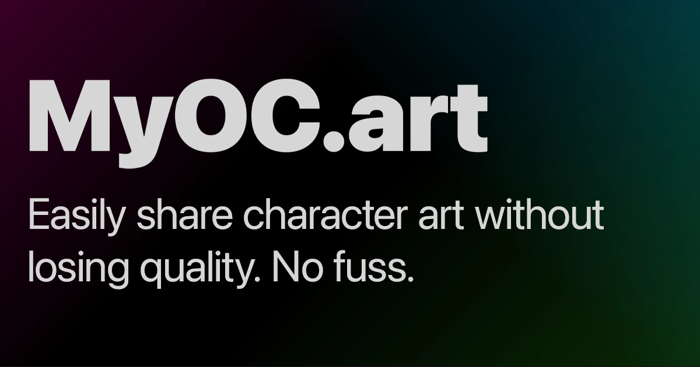

# MyOC

**High-resolution character galleries without the social-network sprawl.**

[](https://workers.cloudflare.com/)

[Features](#features) |
[Quickstart](#quickstart) |
[Contributing](./CONTRIBUTING.md) |
[Security](./SECURITY.md) |
[License](./LICENSE.md)

MyOC is a simple webapp for hosting, organizing, and sharing original character media. It is built for character owners,
artists, and communities that want clean character references, full-resolution media, searchable public profiles, and
useful gallery tools without turning the product into a feed-driven social network.

## Principles

- Keep character galleries fast, readable, and easy to maintain.
- Preserve media quality wherever practical.
- Prefer shared, consistent profile layouts over custom CSS per profile.
- Add tools only when they support character browsing or gallery management.
- Keep operations simple enough to run reliably on Cloudflare.

## Features

- Character profiles with folders, profile images, descriptions, social links, and ordered character lists.
- Gallery editing with tabs, rows, custom ordering, full-width rows, and original media storage.
- Media previews, admin image approval, and report handling.
- User and character search with direct links to public pages.
- Character height calibration, shareable size charts, and site-wide size comparison.
- Toyhou.se migration flow for importing characters and gallery images.
- Versioned release notes shown to signed-in users.

## Quickstart

Requirements: Node.js 22 or newer, npm, and Wrangler access for Cloudflare-backed development tasks.

```sh
npm install
cp .dev.vars.example .dev.vars
npm run db:prepare:local
npm run dev
```

Seeded local accounts use `password123`; the `demo` user is available after loading development seed data.

Before opening a pull request, run:

```sh
npm run check
npm run build
```

## Common Commands

| Command                    | Purpose                                                               |
|----------------------------|-----------------------------------------------------------------------|
| `npm run dev`              | Generate Cloudflare types, build assets, and start local development. |
| `npm run check`            | Run type generation, TypeScript checks, and tests once.               |
| `npm run build`            | Build public assets.                                                  |
| `npm run db:prepare:local` | Apply local migrations and seed data.                                 |
| `npm run deploy`           | Run checks, build assets, and deploy.                                 |

## Repository Guide

| Path                         | Purpose                                                         |
|------------------------------|-----------------------------------------------------------------|
| [`src/routes`](./src/routes) | Page and API route handlers.                                    |
| [`src/views`](./src/views)   | Server-rendered layouts, components, and pages.                 |
| [`src/lib`](./src/lib)       | Auth, media, search, admin, gallery, and shared business logic. |
| [`migrations`](./migrations) | D1 schema history.                                              |
| [`scripts`](./scripts)       | Local utility scripts.                                          |
| [`.github`](./.github)       | Issue templates and CI/deployment workflows.                    |

## Project Documents

- [Contributing](./CONTRIBUTING.md)
- [Code of Conduct](./CODE_OF_CONDUCT.md)
- [Support](./SUPPORT.md)
- [Security](./SECURITY.md)
- [Contributor License Agreement](./CLA.md)
- [License](./LICENSE.md)

## License

MyOC is licensed under the Business Source License 1.1. It is source-available, not open source, until the Change Date
described in [`LICENSE.md`](./LICENSE.md).
